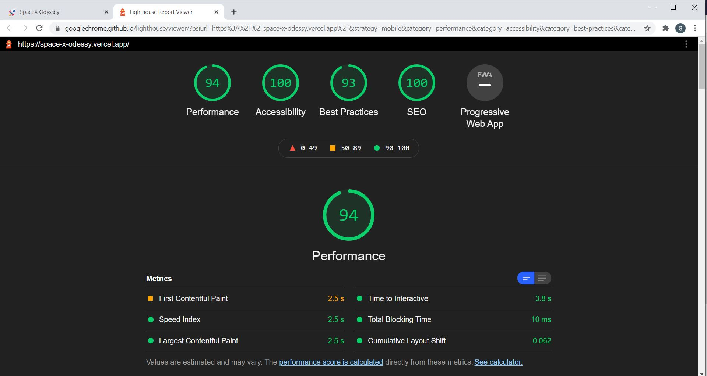
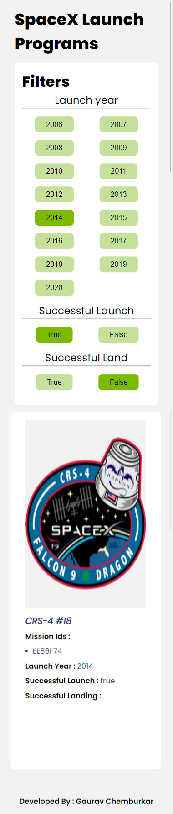
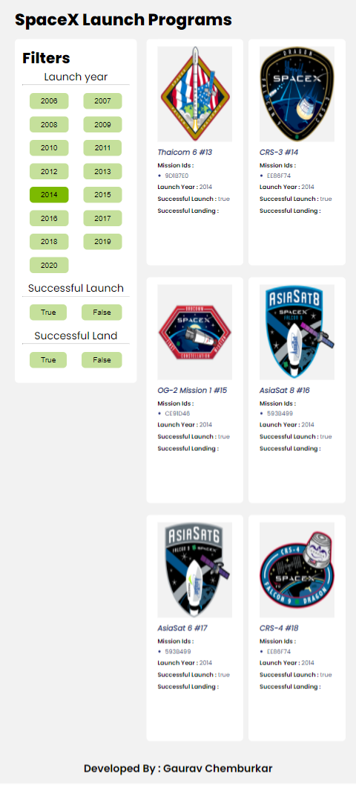
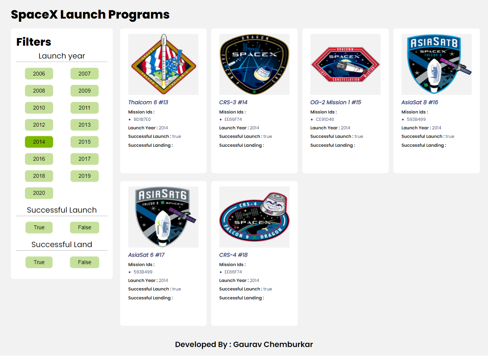

# ***SpaceX-Odyssey***
Consumes SpaceX data public  to show mission details filtered by year, launch and land success.

https://space-x-odessy.vercel.app/

## Running locally in development mode

To get started, just clone the repository and run `npm install && npm run dev`:

    git clone https://github.com/GauravC4/SpaceX-Odessy.git
    npm install
    npm run dev
    
## Building and deploying in production

If you wanted to run this site in production, you should install modules then build the site with `npm run build` and run it with `npm start`:

    npm install
    npm run build
    npm start
    
In both cases the app should be up and running at http://localhost:3000

## Demo

## Technology used
It uses  which is a React Server Side Rendering framework.
First page is rendered on server which provides better SEO support and performace, subsequent requests are taken care of with ajax and json response from server so page refresh is not required to update data.

For styling global and component level css is used. Media queries are used for responsive design with mobile first approach. Layout uses a combination of flex box and css grid.

 library is used for the loading animation.

## Google Lighthouse Score

## Responsiveness
### Mobile

### Tablet

### Desktop

## Attribution
Icons made by <a href="https://www.flaticon.com/authors/freepik" title="Freepik">Freepik</a> from <a href="https://www.flaticon.com/" title="Flaticon"> www.flaticon.com</a>
